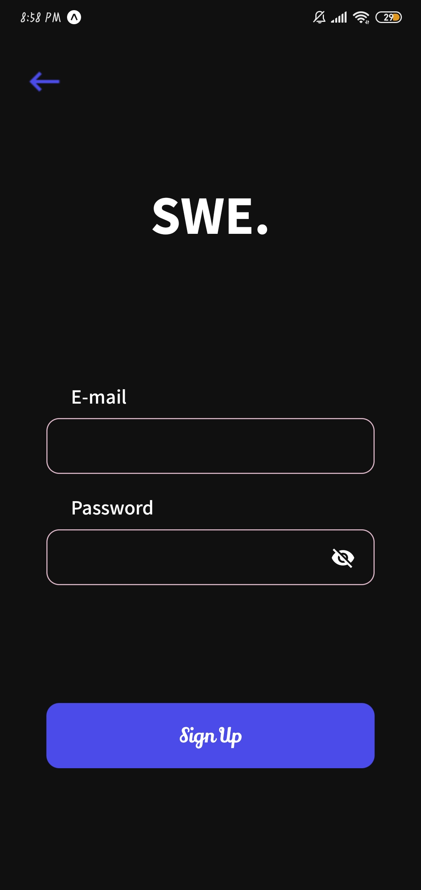
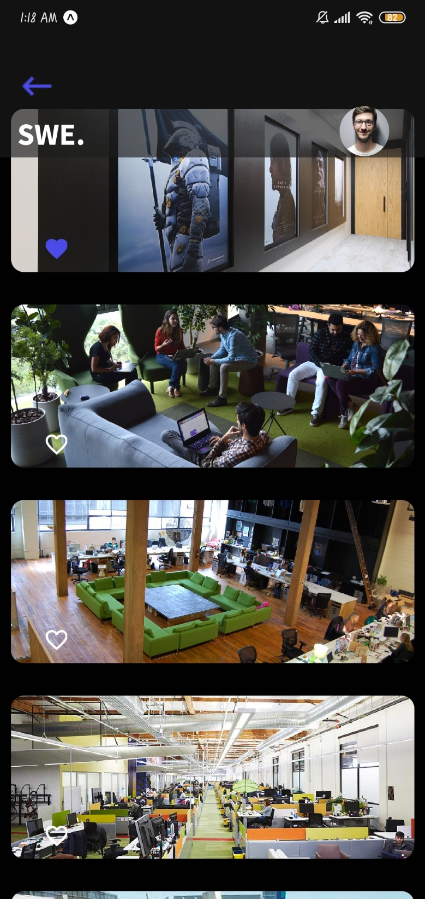
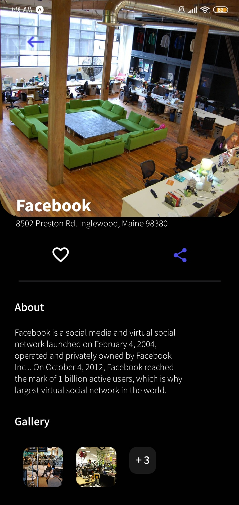
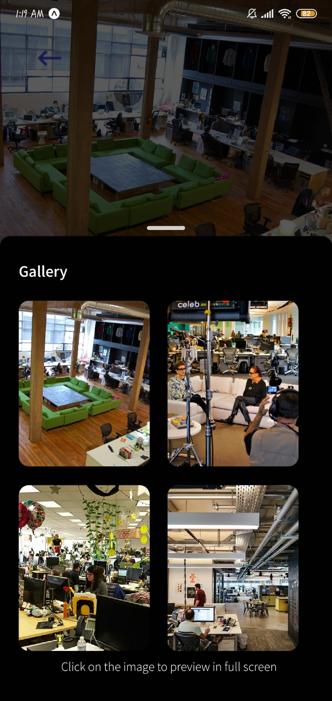
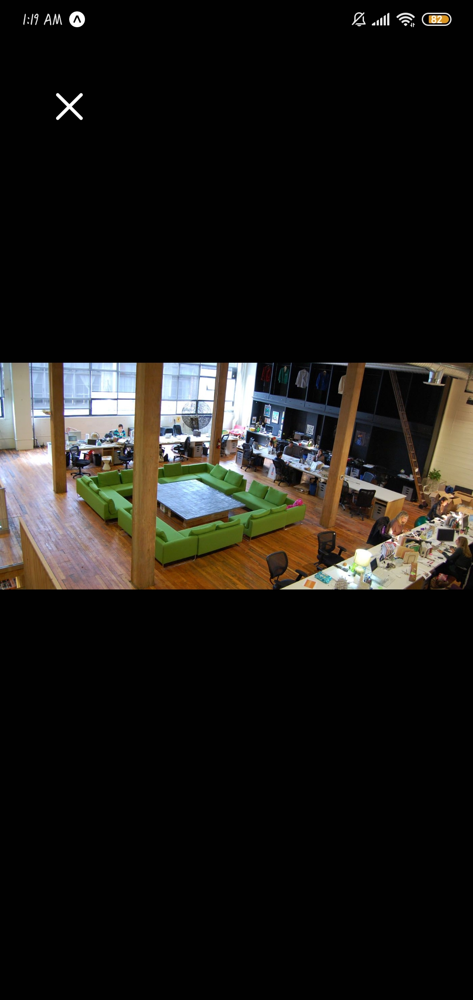

<div align="center">
<h1>ShareWork Envirnoments</h1>
<h2>Shared work environments is an application for sharing work environments in order to inspire future companies when building their environment.
</h2>
</img>
</img>
</img>
</img>
</img>
</img>
</div>

## 🚀 Technologies
- React Native
- React Navigation Stack
- Expo icons
- Expo Blur
- Modalize
- TypeScript

## 💻 Getting Started

**Clone the project and access the folder**

```bash
$ git clone https://github.com/gustavo867/sharework-environments.git && cd sharework-environments
```

**Follow the steps below**

```bash
# Install the dependencies
$ yarn or npm

# If you are going to emulate with android, run this command
# Be sure to have the emulator open
$ yarn android

# If you are going to emulate with ios, run this command
$ yarn ios

# If you are going to use smartphone 
$ yarn start or expo start
```

## 🤔 How to contribute

**Make a fork of this repository**

```bash
# Fork using GitHub official command line
# If you don't have the GitHub CLI, use the web site to do that.

$ gh repo fork gustavo867/sharework-environments
```

**Follow the steps below**

```bash
# Clone your fork
$ git clone https://github.com/gustavo867/sharework-environments.git && cd sharework-environments

# Create a branch with your feature
$ git checkout -b my-feature

# Make the commit with your changes
$ git commit -m 'feat: My new feature'

# Send the code to your remote branch
$ git push origin my-feature
```

After your pull request is merged, you can delete your branch

 
## 📝 License

This project is licensed under the MIT License - see the [LICENSE](LICENSE) file for details.

---

Made with 💜 by Gustavo Santana 👋 [See my linkedin](https://www.linkedin.com/in/gustavo-santana-83ba611a6/)